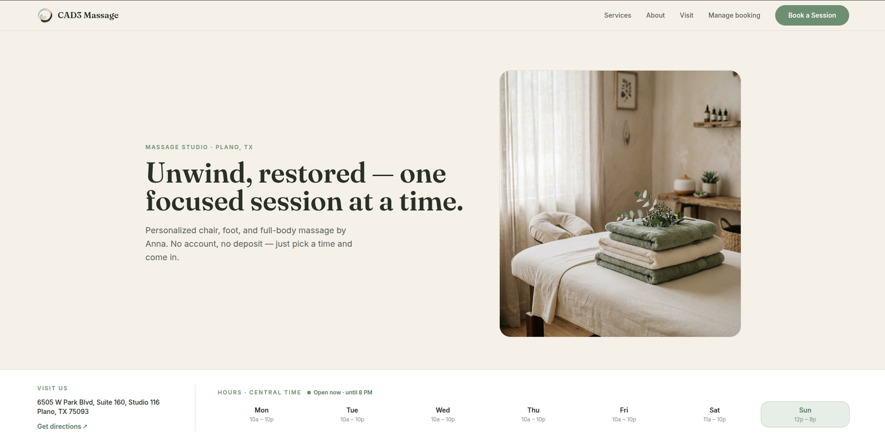
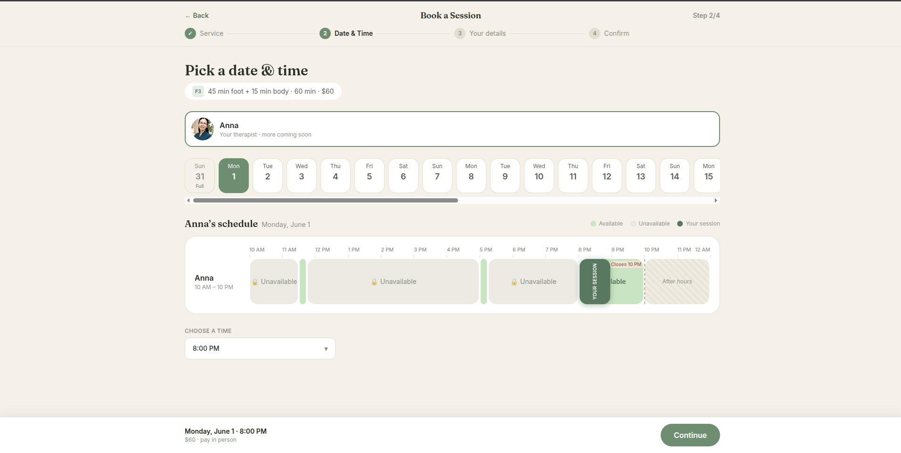
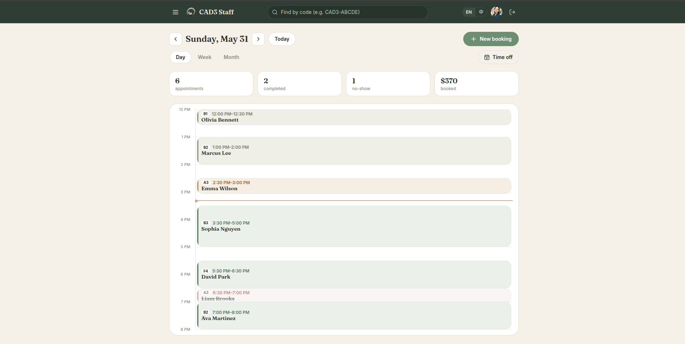
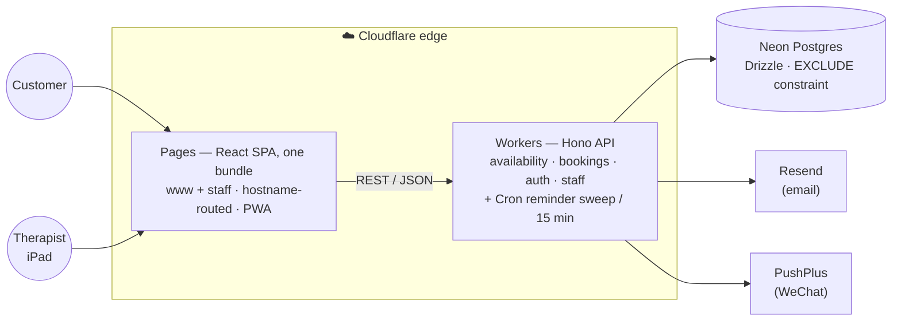

<div align="center">


# CAD3 Massage

### Website &amp; online booking system for a real massage studio — designed, built, and shipped to production on Cloudflare's edge.

[](#)
[](#)
[](#)
[](#)
[](#)
[](#)
[](#)

**[🌐 Live site](https://www.cad3massage.com)** &nbsp;·&nbsp; *single-developer project, end-to-end*

</div>

---

A complete, **production** booking platform for a single-therapist massage studio in Plano, TX. Guests book an appointment in under two minutes with no account; the therapist runs the entire schedule from a tablet. It's live on a real domain, taking real bookings, and sending real confirmations — designed and built solo: **branding, UX, frontend, backend, database, notifications, and edge deployment.**

<div align="center">

<p><b>Marketing site</b> — services, story, live map &amp; hours</p>


<br/><br/>

<p><b>Booking</b> — pick a service, then an open slot on a visual day timeline</p>


<br/><br/>

<p><b>Staff console</b> — the therapist's day at a glance, with status &amp; revenue</p>


</div>

---

## What it does

| | |
|---|---|
| 🧖 **Customers** | Browse services → pick an open time on a visual schedule → enter details → done. No account, pay in person. Look up or cancel a booking by confirmation code. Installable as a PWA. |
| 🗓️ **The therapist** | Tablet-first console: day / week / month schedule, drag-to-create time off, reschedule with live conflict checks, manual phone-in bookings, confirmation-code search — bilingual (EN / 中). Repeat **no-show customers are flagged** on sight, and **back-to-back** / **walk-in** toggles drop the rest-buffer or the 1-hour notice for true consecutive or same-hour appointments — on both new bookings and reschedules. |
| 🔔 **Automatically** | Confirmation, cancellation, reschedule &amp; staff-alert emails, a secondary WeChat push for the owner, and a Cron-driven 2-hour reminder sweep. |

---

## 🧠 Why it's interesting (engineering)

Each of these was a deliberate decision, not an accident. They're the parts I'd want to talk through in an interview.

### Double-booking is impossible *by construction*

Guarding overlaps in application code is racy on serverless, where requests run in parallel isolates. So the **database is the single source of truth** — a Postgres exclusion constraint rejects any overlapping appointment at write time:

```sql
EXCLUDE USING gist (
  therapist_id WITH =,
  tstzrange(start_at, occupied_until) WITH &&   -- occupied = service + buffer
) WHERE (status IN ('pending','confirmed'))
```

The endpoint simply `INSERT`s and catches SQLSTATE `23P01` → `409 Conflict` — no `SELECT-then-INSERT`, no transactions (the production driver has none). An acceptance test fires concurrent requests at one slot and asserts **exactly one `201` and one `409`**.

Two studio rules ride on the same machinery. The 30-minute rest **buffer is baked into `occupied_until`** (so the exclusion constraint enforces it too), and online bookings need **1 hour's notice**. Staff can override either — a **back-to-back** toggle drops the buffer, a **walk-in** toggle drops the lead time — on both new bookings and reschedules. But the public path *always* enforces both: the override flags **aren't in the public booking schema**, and the server re-validates every incoming booking against the strict defaults — so a guest can never quietly take the therapist's rest gap or slip a booking inside the hour. Every direction is covered by acceptance tests (`BUF-*`, `LEAD-*`).

### One availability engine — *what we offer* and *what we accept* can never drift

The same pure function computes the customer's open slots **and** validates the incoming booking server-side. Working hours come from the DB (so the staff "Working Hours" editor actually drives availability), minus time off, minus existing bookings' buffered occupancy, snapped to a 15-minute grid and no sooner than the 1-hour lead time. Offer and accept are literally the same code path — and because it's a pure function of `now` + state, the tricky boundaries (flush back-to-back, the 1-hour lead window) are pinned down by deterministic acceptance cases.

### Same code, two runtimes — the DB driver swaps itself

Locally the API runs on Node against Dockerized Postgres; in production it runs on Cloudflare Workers against Neon. **Identical query code** — only the driver differs, resolved by a `package.json` subpath import:

```jsonc
"imports": {
  "#db": {
    "workerd": "./src/db/neon.ts",     // Workers → neon-http
    "default": "./src/db/index.ts"      // Node    → node-postgres
  }
}
```

`pg` never enters the Worker bundle, and there's no build-time aliasing to maintain.

### One app, two domains — routed at runtime by hostname

The public site and the staff console ship as **one React bundle from one Pages project**, yet behave like two separate apps. A small host helper picks the route tree from the request's hostname:

```ts
const onStaffHost = location.hostname.startsWith('staff.');
// staff subdomain → console at "/";  main domain → marketing + booking
```

The staff subdomain boots straight into the console; the main domain serves the customer site and bounces any stray `/staff` link over to it. **One build, one deploy, no duplicated code** — with clean, separate URLs for customers and staff.

### Correct timezones, always · Fail-closed security

- Everything is computed and shown in the studio's timezone (`America/Chicago`) regardless of where the server or visitor is — `date-fns-tz` with DST-safe date stepping; the DB stores `timestamptz`, the API speaks ISO-8601 with offsets.
- Staff auth is JWT with **PBKDF2 password hashing via WebCrypto** (works on Node *and* Workers). The secret guard **refuses to boot** on the dev default once real origins are configured — even though Workers don't set `NODE_ENV` — so a forgotten secret can't silently ship. CORS is locked to the production origins.

### Notifications: pluggable &amp; non-blocking · Tested as a black box

- Email (Resend) and WeChat (PushPlus) sit behind small provider interfaces (console vs. real, gated by env flags). Sends are fire-and-forget via `ctx.waitUntil()` on Workers, so a slow mail API can never delay or fail a booking. A **Cron Trigger** runs an idempotent reminder sweep.
- A Vitest harness hits the running API over HTTP with **stable case IDs** (`BOOK-05`, `AVAIL-06`, `BUF-12`, `LEAD-02`, …) mirroring a written acceptance plan — covering the menu, availability invariants, the double-booking race, the buffer / back-to-back / lead-time policy, lookup/cancel, auth guards, and that availability never leaks other customers' data.

<details>
<summary><b>Platform gotchas I hit and handled</b> (debugging stories)</summary>

- **Cloudflare Workers cap PBKDF2 at 100,000 iterations** — `crypto.subtle.deriveBits` *throws* above that. It only surfaced on the deployed Worker (local Node has no cap), so login 500'd in production while passing locally. Pinned to the platform max and now verified end-to-end on Workers, not just on Node.
- **`drizzle-orm` 0.36 is incompatible with `@neondatabase/serverless` 1.x** (the 1.0 release dropped function-call-style queries) — pinned via a root `overrides`.
- **SPA deep links** 404 on refresh without a Pages `_redirects` fallback.

</details>

---

## 🏗️ Architecture



- **Monorepo** (npm workspaces): `frontend/` · `backend/` · `shared/` (types, Zod schemas, service catalog &amp; business rules used by both) · `script/` (acceptance tests).
- **Local dev** runs real Postgres in Docker — so the `btree_gist` + `EXCLUDE` constraint behaves exactly as in prod — and one command (`./dev.sh`) brings up DB + API + web.

---

## 🧰 Tech stack

| Layer | Choices |
|---|---|
| **Frontend** | React 18 · TypeScript · Vite · Tailwind CSS · React Router · TanStack Query · `vite-plugin-pwa` (installable) |
| **Backend** | Hono on Cloudflare Workers (Node locally) · Drizzle ORM · Zod · `date-fns-tz` |
| **Database** | PostgreSQL — Neon (serverless) in prod, Docker locally · raw-SQL migrations · `EXCLUDE` + `btree_gist` |
| **Infra** | Cloudflare Pages + Workers + Cron Triggers · custom domains · Wrangler |
| **Notifications** | Resend (email) · PushPlus (WeChat staff push) |
| **Quality** | Vitest black-box acceptance suite · strict TypeScript across all packages |
| **Design** | Done in-house — "Sage &amp; Cream" palette, Fraunces + Inter, a hand-tuned ensō brush-ring logo |

---

## 📁 Project structure

```
frontend/   React SPA — customer site + staff console (hostname-routed)   → CF Pages
backend/    Hono API · availability engine · notifications · Cron worker   → CF Workers
shared/     TS types, Zod schemas, service catalog, business rules (both)
script/     black-box acceptance & regression harness (Vitest)
docs/       store info & service menu
dev.sh      one command: Postgres → migrate → seed → API + web
```

<details>
<summary><b>▶️ Run it locally</b></summary>

> Requires Node ≥ 20 and Docker.

```bash
cp .env.example .env       # local defaults work out of the box
npm install
./dev.sh                   # Postgres (Docker) → migrate → seed → API :8787 + web :5173
```

Open **http://127.0.0.1:5173** (customer) and **/staff** (console; seed credentials come from your `.env`). Notifications are **off by default** locally — a console provider logs instead of sending, so nothing leaves your machine.

```bash
npm run accept             # acceptance suite against the local API
npm run build              # production build of the web app (PWA)
```

</details>

---

## 🎯 Scope &amp; decisions

It's an MVP **on purpose**, with the seams already cut for growth:

- **One therapist today, modeled for many** — the schema and availability engine are already multi-therapist; the UI surfaces one.
- **Guest-only booking**, **pay-in-person** (no accounts, no PCI surface) — the studio's call.
- **Device-persistent staff login** — sign in once on a private iPad; long-lived token, revoked by deactivating the account.
- **If I took it further:** Playwright E2E across the booking flow, a multi-therapist UI, SMS reminders (Twilio + A2P 10DLC), and an admin role.

---

## 📝 About this repo

Shared as a **portfolio piece** — a look at how I take a product from a blank page to a live URL, not a template to fork. It's the real source, with secrets, personal data, and heavy demo media deliberately kept out: keys live only in `.env` / Workers secrets (never committed), and the hero imagery, therapist photo, and design source are omitted to keep the checkout lean. The screenshots above and the **[live site](https://www.cad3massage.com)** show the real thing.

<div align="center">

**Designed &amp; built by Yixin Wei** &nbsp;·&nbsp; *feedback welcome*

</div>
